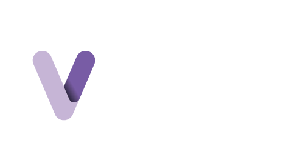

<!--horizontal divider(gradiant)-->

<!--h1 without bottom border-->

  <ul align="center">
    
<h1 style="display: inline-block">Hi 👋, I'm Over Regino</h1>

  </ul>

<!--Intro start-->
Hello! I am Over Regino, a software developer and physicist from Colombia. I enjoy building software and solving problems with people from all over the world. Working in a team, and adapting to new situations/objectives is something I am completely comfortable with. If you want to just talk software or have a potential opportunity for us to work together, please feel free to reach out!

<!--h2 without bottom border-->

  <ul align="center">
    
<h2 style="display: inline-block">Each bug fixed is a level passed in the programming game 😁 </h2>

  </ul>

<!--Intro start-->
* 🔭 I'm a Physicist, currently focused on programming and data analysis.

* 🔧 I developed my thesis on Raman spectroscopy applied to cerium-doped ZnO using MATLAB.

* ☁️ I stand out for my adaptability and ability to learn. I hope to be a good software developer and an excellent colleague.

* 💻 The work I do at DataForest.io is very rewarding. I'm in charge of optimizing algorithms and improving the website's design to make it more attractive and functional, thus contributing to the company's growth and innovation..
<!--- stats & Trophy (start) -->

        
<!--- stats (end) -->

<!--========================================================================================================================================================================================================-->
<!--h1 without bottom border-->

  <ul align="center">
    
<h2 style="display: inline-block">Technical skills👨🏻‍💻</h2>

  </ul>

<!--tech stack icons-->

  

<!--========================================================================================================================================================================================================-->
<!--h1 without bottom border-->

  <ul align="center">
    
<h2 style="disply: inline-block">Runtimes + Databases + Compilers 🔧💻</h2>

  </ul>

<!--tech stack Editor-->

  

<!--=====================================================================================================================================================-->
<!--==========MIS COMPLIDAORES + RUNTIMES +DATAB===========================================================================================================================================-->
<!-- Connect with me -->
<!--h2 without bottom border-->

  <ul align="center">
    
<h2 style="display: inline-block">Connect with me 🤝</h2>

  </ul>

<!--icons and links-->

  

  

<!--profile visit count-->

  

  

<!--horizontal divider(gradiant)-->

## 🚀 Featured Projects  
<table>
  <tr>
    <td align="center" width="300">
      <a href="https://github.com/RLover06">
        
        <h3>My GitHub</h3>
        
Check my repositories and contributions.

      </a>
    </td>
    <td align="center" width="300">
      <a href="https://airmailer.io">
        
        <h3>AirMailer.io</h3>
        
A platform to buy direct mailing lists.

      </a>
    </td>
    <td align="center" width="300">
      <a href="https://verticalspanish.com">
        
        <h3>Vertical Spanish</h3>
        
Practice Spanish under the stars!

      </a>
    </td>
  </tr>
</table>
