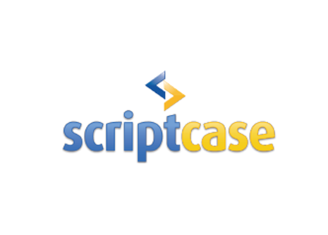

 
 <ul align="center"> 
<h1 style="display: inline-block">Hi 👋, I'm Over Regino</h1>
 </ul> 
 
 <b>Physicist · Math & Physics Teacher · Software Developer</b>  📍 Montería, Colombia 
 
 <ul align="center"> 
<h3 style="display: inline-block">Each bug fixed is a level passed in the programming game 😁</h3>
 </ul> 

I'm a physicist from Colombia who splits his time between two passions: teaching and building software. In the classroom I teach mathematics and physics to high school students; outside of it, I build web applications that solve real problems for real businesses. I enjoy working in teams, adapting to new goals and learning something new every day. If you want to talk software, education, or a potential collaboration, feel free to reach out!

🔭 Physicist focused on programming and data analysis.
🧪 Developed my thesis on Raman spectroscopy applied to cerium-doped ZnO using MATLAB.
👨‍🏫 Math & Physics teacher — I love turning abstract concepts into something students can see and interact with.
💼 At Expertak I optimize algorithms and automations for accounting processes, including DIAN-compliant electronic invoicing, and improve the platform's design and usability.
✂️ Currently building Citastylo, an appointment booking app for barbershops and beauty salons.
☁️ I stand out for my adaptability and ability to learn fast.
 
 <ul align="center"> 
<h2 style="display: inline-block">🚀 Featured Projects</h2>
 </ul> 
 <table align="center"> <tr> <td align="center" width="50%"> <a href="https://expertak.kaizenerp.com.co/menu/">  <h3>Expertak</h3> </a> 
Web platform for organizing and carrying out accounting processes for real client companies, with electronic invoicing support.
 </td> <td align="center" width="50%"> <a href="https://github.com/RLover06/citastylo"> <h1>✂️</h1> <h3>Citastylo</h3> </a> 
Appointment booking app for barbershops and beauty salons: clients book from their phone, barbers manage their daily schedule, with WhatsApp confirmations. Available in English and Spanish.
 </td> </tr> <tr> <td align="center" width="50%"> <a href="https://github.com/RLover06?tab=repositories"> <h1>🍕</h1> <h3>Fraction Visualizer (STEM)</h3> </a> 
Interactive web page that shows any fraction as a pie, grid and bar at the same time — including improper fractions — to help students understand numerator and denominator. ES/EN.
 </td> <td align="center" width="50%"> <a href="https://dataforest.io/">  <h3>Dataforest.io</h3> </a> 
A direct marketing platform.
 </td> </tr> </table>  
 <ul align="center"> 
<h2 style="display: inline-block">👨🏻‍💻 Tech Stack</h2>
 </ul> 
 <h4 align="center">Languages</h4> 
  
 <h4 align="center">Frameworks & Libraries</h4> 
  
 <h4 align="center">Databases & Backend Services</h4> 
   
 <h4 align="center">Cloud & Tools</h4> 
  
 <h4 align="center">Low-code</h4> 
  
  
 <ul align="center"> 
<h2 style="display: inline-block">📊 GitHub Stats</h2>
 </ul> 
 
   
 
 <ul align="center"> 
<h2 style="display: inline-block">🤝 Connect with me</h2>
 </ul> 
 
    
 
  
 
  </tr>
</table>
